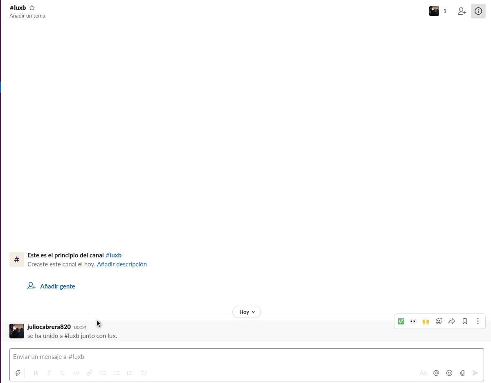

### Lux shows information about your github profile

## Usage

- [Run slack bot](#development) 
* Add the slackbot to your channel

 
  

## Development

After checking out the repo, run `bundle install` to install dependencies. Then run `rackup` to run the slack bot.

## Contributing

Bug reports and pull requests are welcome on GitHub at https://github.com/juliocabrera820/lux
